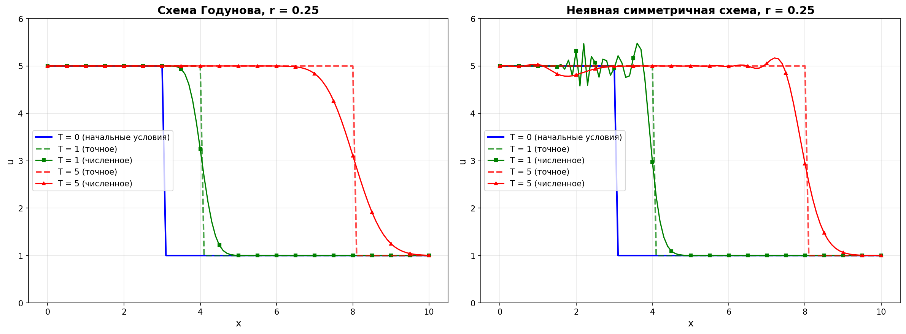
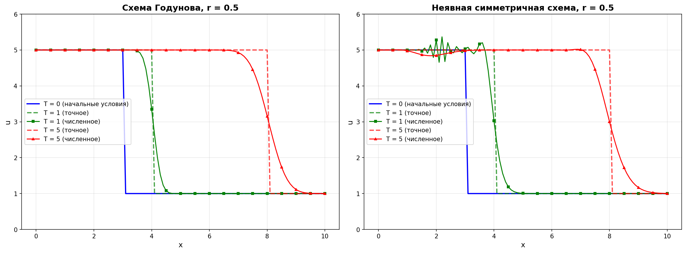
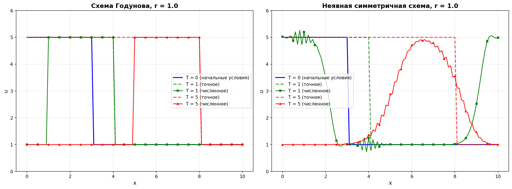
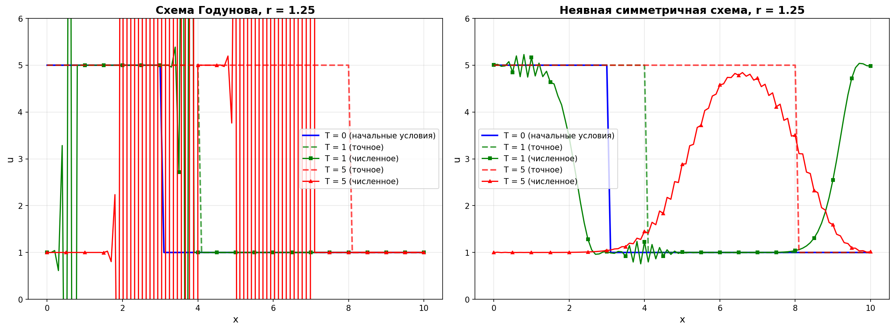

# Отчёт по вычислительному заданию "Разностные схемы"

## Задание 1: Численное решение обыкновенного дифференциального уравнения

### Постановка задачи

Требуется найти численное решение уравнения:

$$y'(x) = f(x, y) = x \cdot y$$

на отрезке $[0, 1]$ с шагом $h = 0.1$ и начальным условием $y(0) = 1$.

Точное решение данной задачи Коши:

$$y(x) = e^{x^2/2}$$

### Используемые методы

#### 1. Метод Эйлера (схема "разность вперед")

Явная разностная схема первого порядка точности:

$$y_{n+1} = y_n + h \cdot f(x_n, y_n)$$

#### 2. Метод Рунге-Кутты третьего порядка

Более точная явная схема:

$$k_1 = h \cdot f(x_n, y_n)$$

$$k_2 = h \cdot f\left(x_n + \frac{h}{2}, y_n + \frac{k_1}{2}\right)$$

$$k_3 = h \cdot f(x_n + h, y_n + 2k_2 - k_1)$$

$$y_{n+1} = y_n + \frac{1}{6}(k_1 + 4k_2 + k_3)$$

### Результаты численного решения

| x    | Точное решение | Метод Эйлера | Ошибка Эйлера | Метод РК | Ошибка РК |
|------|----------------|--------------|---------------|----------|-----------|
| 0.0  | 1.000000       | 1.000000     | 0.00e+00      | 1.000000 | 0.00e+00  |
| 0.1  | 1.005013       | 1.000000     | 5.01e-03      | 1.005013 | 8.35e-08  |
| 0.2  | 1.020201       | 1.010000     | 1.02e-02      | 1.020201 | 3.44e-07  |
| 0.3  | 1.046028       | 1.031000     | 1.50e-02      | 1.046028 | 7.99e-07  |
| 0.4  | 1.083287       | 1.064100     | 1.92e-02      | 1.083287 | 1.56e-06  |
| 0.5  | 1.133148       | 1.110510     | 2.26e-02      | 1.133148 | 2.73e-06  |
| 0.6  | 1.197217       | 1.172161     | 2.51e-02      | 1.197216 | 4.48e-06  |
| 0.7  | 1.277434       | 1.251377     | 2.61e-02      | 1.277433 | 7.01e-06  |
| 0.8  | 1.377128       | 1.351015     | 2.61e-02      | 1.377126 | 1.06e-05  |
| 0.9  | 1.499969       | 1.474446     | 2.55e-02      | 1.499966 | 1.57e-05  |
| 1.0  | 1.648721       | 1.625780     | 2.29e-02      | 1.648717 | 2.28e-05  |

### Оценка точности по методу Рунге

Метод Рунге позволяет оценить погрешность численного решения двумя способами:

1. **При известном точном решении**: $\varepsilon = |y_{\text{exact}} - y_h|$
2. **При неизвестном точном решении**: $\varepsilon \approx \frac{|y_{h/2} - y_h|}{2^p - 1}$, где $p$ — порядок точности метода

#### Метод Эйлера (p = 1)

| x   | Ошибка (известное) | Ошибка (неизвестное) |
|-----|--------------------|--------------------|
| 0.0 | 0.00e+00          | 0.00e+00           |
| 0.1 | 5.01e-03          | 4.76e-03           |
| 0.2 | 1.02e-02          | 9.77e-03           |
| 0.3 | 1.50e-02          | 1.48e-02           |
| 0.4 | 1.92e-02          | 1.93e-02           |
| 0.5 | 2.26e-02          | 2.33e-02           |
| 0.6 | 2.51e-02          | 2.67e-02           |
| 0.7 | 2.61e-02          | 2.91e-02           |
| 0.8 | 2.61e-02          | 3.03e-02           |
| 0.9 | 2.55e-02          | 3.01e-02           |
| 1.0 | 2.29e-02          | 2.83e-02           |

#### Метод Рунге-Кутты (p = 3)

| x   | Ошибка (известное) | Ошибка (неизвестное) |
|-----|--------------------|--------------------|
| 0.0 | 0.00e+00          | 0.00e+00           |
| 0.1 | 8.35e-08          | 1.16e-07           |
| 0.2 | 3.44e-07          | 4.85e-07           |
| 0.3 | 7.99e-07          | 1.14e-06           |
| 0.4 | 1.56e-06          | 2.25e-06           |
| 0.5 | 2.73e-06          | 3.98e-06           |
| 0.6 | 4.48e-06          | 6.58e-06           |
| 0.7 | 7.01e-06          | 1.04e-05           |
| 0.8 | 1.06e-05          | 1.58e-05           |
| 0.9 | 1.57e-05          | 2.36e-05           |
| 1.0 | 2.28e-05          | 3.44e-05           |

### Графики

**Описание графиков:**

1. **Верхний левый**: сравнение численных решений (Эйлер и РК) с точным решением
2. **Верхний правый**: абсолютная погрешность обоих методов (логарифмическая шкала)
3. **Нижний левый**: оценка погрешности для метода Эйлера при известном и неизвестном точном решении
4. **Нижний правый**: оценка погрешности для метода РК при известном и неизвестном точном решении

### Анализ результатов

1. **Метод Эйлера** показывает погрешность порядка $O(h) \sim 10^{-2}$, что соответствует первому порядку точности
2. **Метод Рунге-Кутты** имеет погрешность порядка $O(h^3) \sim 10^{-5}$, что значительно точнее
3. **Оценка по методу Рунге** при неизвестном точном решении даёт результаты того же порядка, что и истинная погрешность, что подтверждает корректность метода
4. Метод РК примерно в **1000 раз точнее** метода Эйлера при том же шаге интегрирования

---

## Задание 2: Численное решение уравнения переноса

### Постановка задачи

Требуется найти численное решение линейного уравнения переноса:

$$\frac{\partial u}{\partial t} + a \frac{\partial u}{\partial x} = 0$$

при $a = 1$ на отрезке $[0, 10]$ с начальными условиями:

$$u(x, 0) = \begin{cases} 5, & x \leq 3 \\ 1, & x > 3 \end{cases}$$

Шаг по пространству: $h = 0.1$

Число Куранта: $r = \frac{a\tau}{h}$, где $\tau$ — шаг по времени

Расчёты проводятся для $r \in \{0.25, 0.5, 1.0, 1.25\}$ на моменты времени $T \in \{0, 1, 5\}$

### Используемые методы

#### 1. Схема Годунова (явная односторонняя)

Разностная схема с односторонней разностью назад:

$$\frac{u_i^{n+1} - u_i^n}{\tau} + a\frac{u_i^n - u_{i-1}^n}{h} = 0$$

$$u_i^{n+1} = u_i^n - r(u_i^n - u_{i-1}^n)$$

**Свойства:**
- Явная схема первого порядка точности
- Устойчива при $r \leq 1$ (условие Куранта)

#### 2. Неявная симметричная схема

Разностная схема с центральной разностью:

$$\frac{u_i^{n+1} - u_i^n}{\tau} + a\frac{u_{i+1}^{n+1} - u_{i-1}^{n+1}}{2h} = 0$$

$$u_i^{n+1} - \frac{r}{2}(u_{i+1}^{n+1} - u_{i-1}^{n+1}) = u_i^n$$

**Свойства:**
- Неявная схема второго порядка точности
- Безусловно устойчива (устойчива при любых $r$)
- Требует решения системы линейных уравнений на каждом временном шаге

### Точное решение

Уравнение переноса имеет точное решение:

$$u(x, t) = u(x - at, 0)$$

Решение представляет собой перенос начального профиля вправо со скоростью $a = 1$.

### Результаты расчётов

#### r = 0.25 (τ = 0.025)

| Время | Схема Годунова (макс. ошибка) | Неявная схема (макс. ошибка) |
|-------|-------------------------------|------------------------------|
| T = 1 | 0.603418                      | 0.587355                     |
| T = 5 | 1.585902                      | 1.545698                     |

#### r = 0.5 (τ = 0.05)

| Время | Схема Годунова (макс. ошибка) | Неявная схема (макс. ошибка) |
|-------|-------------------------------|------------------------------|
| T = 1 | 0.585288                      | 0.578819                     |
| T = 5 | 1.534664                      | 1.516337                     |

#### r = 1.0 (τ = 0.1)

| Время | Схема Годунова (макс. ошибка) | Неявная схема (макс. ошибка) |
|-------|-------------------------------|------------------------------|
| T = 1 | 0.000000                      | 0.573210                     |
| T = 5 | 0.000000                      | 1.490355                     |

#### r = 1.25 (τ = 0.125)

| Время | Схема Годунова (макс. ошибка) | Неявная схема (макс. ошибка) |
|-------|-------------------------------|------------------------------|
| T = 1 | 21.976230                     | 0.573143                     |
| T = 5 | 9.462163e+12                  | 1.472706                     |

### Анализ результатов

#### Схема Годунова

1. **При r ≤ 1**: схема устойчива, но наблюдается **числовая диффузия** — разрыв "размазывается"
2. **При r = 1**: схема даёт **точное решение** без диффузии (это характерное свойство при условии Куранта r = 1)
3. **При r > 1**: нарушается условие устойчивости Куранта-Фридрихса-Леви, решение становится **неустойчивым** с экспоненциальным ростом ошибок
4. С увеличением времени численная диффузия усиливается (разрыв размывается сильнее)

#### Неявная симметричная схема

1. **Безусловная устойчивость**: схема остаётся устойчивой при всех значениях r
2. **Дисперсия**: на разрывах появляются **осцилляции** (эффект Гиббса)
3. **Порядок точности**: схема имеет второй порядок, но на разрывных решениях точность падает
4. Погрешность практически не зависит от значения r (в диапазоне 0.25–1.25 отличия минимальны)

#### Сравнение методов

| Критерий              | Схема Годунова        | Неявная симметричная |
|-----------------------|-----------------------|----------------------|
| Устойчивость          | r ≤ 1                 | Безусловная          |
| Порядок точности      | O(h)                  | O(h²)                |
| Численная диффузия    | Значительная          | Отсутствует          |
| Дисперсия (осцилляции)| Отсутствует           | Присутствует         |
| Вычислительная сложность | Низкая (явная)    | Высокая (СЛАУ)       |
| Точность при r = 1    | Точное решение        | Есть погрешность     |

### Выводы

1. **Схема Годунова** эффективна для гиперболических уравнений при соблюдении условия Куранта (r ≤ 1), особенно при r = 1 даёт точное решение
2. **Неявная схема** более универсальна благодаря безусловной устойчивости, но требует больше вычислительных ресурсов
3. Оба метода имеют проблемы с разрывными решениями: диффузия у Годунова и осцилляции у неявной схемы
4. Для точного решения разрывных задач требуются специализированные методы (TVD, WENO и др.)

---

## Заключение

В данной работе были реализованы и исследованы различные численные методы решения дифференциальных уравнений:

1. Для **обыкновенных ДУ**: метод Эйлера (первого порядка) и метод Рунге-Кутты (третьего порядка) показали существенную разницу в точности
2. Для **уравнения переноса**: схема Годунова и неявная симметричная схема продемонстрировали разные подходы к балансу между устойчивостью и точностью
3. **Метод Рунге** подтвердил свою эффективность для оценки погрешности без знания точного решения

Численные эксперименты подтвердили теоретические оценки порядков точности и условий устойчивости разностных схем.